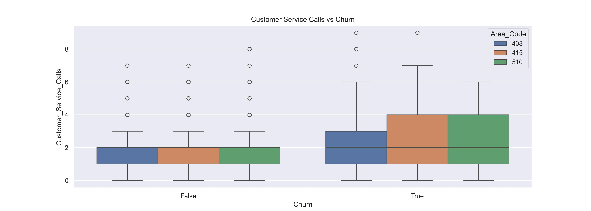
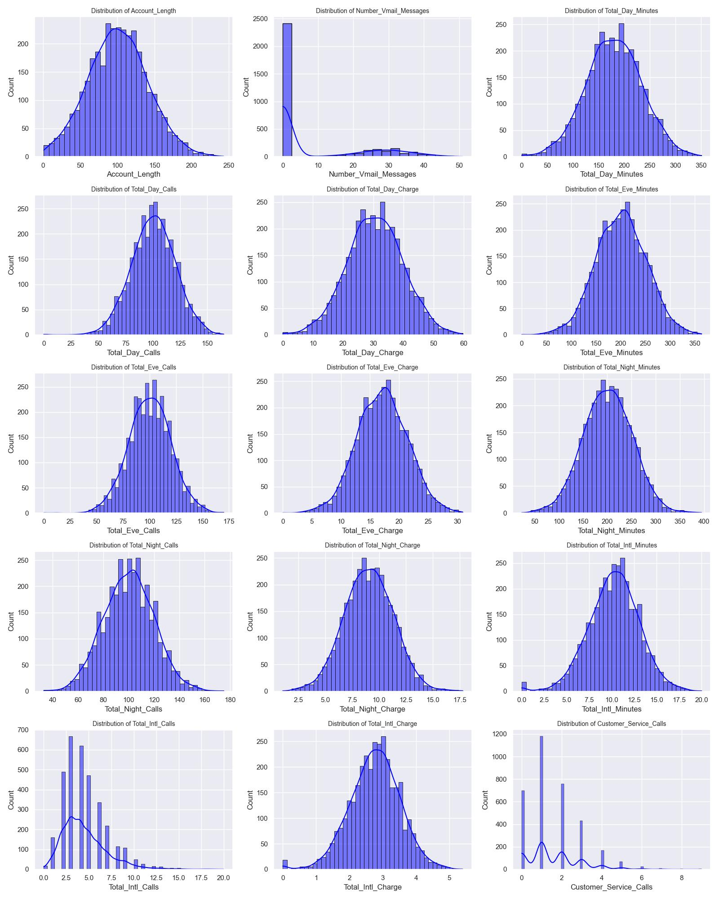
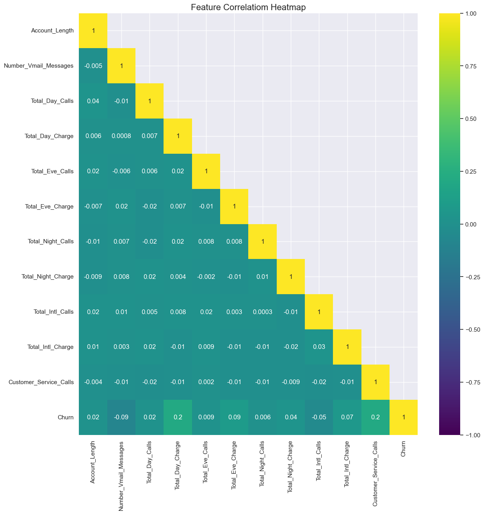

# ☎️ SyriaTel Customer Churn Prediction

Author: [Patrick Maina](https://github.com/Patricknmaina)

This project aims to develop a prediction model for SyriaTel Telecommunication company, that will be able to predict customer churn from the company.

## 💼 **Business Understanding.**

### Introduction
The telecommunications industry has become very competitive over the years, with customer retention emerging as a critical challenge. One of the major issues facing telecom providers is customer churn - a scenario where users discontinue their service, either due to dissatisfaction from the provider, or due to the availability of better alternatives. High churn rates can significantly impact a company's overall revenue, and scaling potential.

In response to this challenge, telecom companies are exploring churn prediction mechanisms, which will proactively address customer concerns, improve service delivery, and implement targeted retention strategies. In light of this, this project aims to develop a predictive model that will identify customers at risk of churning, helping SyriaTel Telecommunications company minimize churn, and enhance long-term profitability.

### Problem Statement.
SyriaTel, a leading telecom provider, is experiencing a significant loss of customers who are choosing to leave its services for other competitors. To address this challenge, the company seeks to build a robust predictive model capable of identifying customers who are at risk of churning. By leveraging on data-driven insights and predictive modeling, SyriaTel aims to understand the key drivers of customer attrition, determing methods of improving long-term retention of customers, and enhance long-term customer loyalty and profitability.

### Objectives.
The main objectives for this project are:
- To determine the key characteristics and behavior patterns that likely contribute to customer churn.

- To build a robust predictive model that will identify customers with a high likelihood of discontinuing their service.

- To provide data-driven insights and recommendations that will proactively engage, and retain high-risk customers.

## 📊 Dataset
This analysis and modeling utilizes the [Telecom Churn Dataset](https://www.kaggle.com/datasets/becksddf/churn-in-telecoms-dataset) from Kaggle. The dataset includes essential customer-churn attributes such as:

- **State and Area code**: It contains the different states and area codes of the customers subscribed to SyriaTel company, both who are churning and who are not churning from the company.

- **International and Voice Mail Plans**: It gives directive as to which customers are subscribed to either an International plan, voice mail plan, both, or even none.

- **Call rates**: It gives information on the different call rates for the customers for day, night, evening, and international calls

- **Customer Service calls**: It provides information on the number of customer service calls the customers are receiving from support staff in the company.

## 🔍 Methodology
To ensure an effective data analysis and predictive modeling strategy, the notebook will follow a structured approach:
### 1️⃣ Data Exploration
- Loading of the dataset to analyze columns in the dataset, along with data types and number of records.

- Checking for missing values, duplicates or any inconsistencies in the data.

- Computing the descriptive statistics of the dataset to get an idea of the key statistical attributes.

### 2️⃣ Data Manipulation
- Standardizing the column names to have the same name formatting.

- Converting the `Area_Code` feature to an object.

- Dropping the `Phone_Number` feature from the dataset as it was not a major requirement in my analysis and modeling.

### 3️⃣ Exploratory Data Analysis
- Generating visualizations and plots to examine relationships between the features (`Univariate & Bivariate Analysis`).

- Investigating the relationship between the features and the target (`Churn`) through visualizations such as **distribution plots**, **correlation heatmaps**, **box plots** and **bar plots**.

- Handling outliers in the dataset.

- Dropping columns that have high `multicollinearity`

### 4️⃣ Data Preprocessing
- Encoding the features in the dataset for ease of implementation in the modeling stage through techniques such as `Label Encoding` and `One-Hot Encoding`.

- Scaling the numerical features to a range of (`0, 1`) using `MinMaxScaler`

### 5️⃣ Predictive Modeling
- Resampling the data to handle class imbalance in the target variable.

- Implementing the `train_test_split` method to split the dataset into training and testing sets (`80/20 split`)

- Training six different types of models to measure performance using `recall` and `ROC-AUC` metrics, with Logistic Regression as the baseline model.

- Plotting the `confusion matrix` to evaluate the rate of true and false positives and negatives for each model.

### 6️⃣ Model Evaluation
- Plotting `ROC curves` and computing the `AUC scores` of all the six models, and doing a comparison of the curves and the AUC scores.

- Computing the `recall` score of all the six models and comparing the scores of each model.

- Determining the important features for the best performing model.

### 7️⃣ Model Hyperparameter Tuning
- Implementing `random search` on two key models for determining the best hyperparameters for each model.

- Re-training the two models with the optimal hyperparameters, obtaining the classification report, and plotting the confusion matrix.

### 8️⃣ Conclusions and Business Recommendations
- Drawing conclusions from the analysis and modeling process.

- Provision of data-driven insights and recommendations, based on the conducted analysis.

## 📈 Crucial Visualizations
Below are three critical visualizations that provide insights into the rate of churning of customers from SyriaTel Telecommunication company

1️⃣ **Analyzing the Customer Service Calls by Rate of Churn**

2️⃣ **Distribution of the numerical feafures in the dataset**

3️⃣ **Feature Correlation Heatmap**

## 📝 Conclusion
From my prediction modeling analysis, The XGBoost Classifier model had a recall score of `0.82`, while the Gradient Boosting model achieved a recall score of `0.81`. However, the Gradient Boosting model had a higher AUC score of `0.921`, while the XGBoost model had an AUC score of `0.911`. I was able to meet all my set objectives, which were to build a customer churn prediction model with a recall score of 0.8 and above, and to identify the key features that contribute significantly to customer churn, which include `Customer_Service_Calls`, `Total_Day_Charge`, and `International_Plan`. Due to the nature of the project and the prediction problem, I would recommend the `XGBoost classifier model` with a higher recall for predicting customer churn rates at SyriaTel Telecommunication company.

## 💼 Business Recommendations
1. **Targeted Incentives for High-Churn Area Codes**

    Customers in area codes `415` and `510` exhibit higher churn tendencies from my analysis. ***Offering specialized discounts, loyalty rewards, or exclusive promotions*** in these regions can serve as an effective incentive to retain these customers.

2. **Enhance Customer Service Efficiency**

    A high amount of customer service interactions with customers is seen to increase churn. ***Investing in comprehensive training sessions for support stuff***, and ***implmenting better issue/conflict resolution frameworks*** can significantly boost customer satisfation, and in turn minimize the rate of customer churn.

3. **State-Specific Retention Strategies**

    States such as **Texas, New Jersey, Maryland, Miami, and New York** reported an above-average churn rate. To mitigate this challenge, ***developing localized market efforts***, ***personalized engagement strategies***, and ***enhanced customer support*** in these regions would aid in strengthening customer loyalty and retention.

4. **Review and Optimize Call Rate Plans**

    Majority of the customers who churn experience high day, evening, night and international call rates. ***Reassessing the pricing model***, and ***introducing more competitive/bundled plans*** could make the services more attractive, and cost-effective for current users.

By leveraging these insights and recommendations, SyriaTel will be able to implement effective strategies that will enhance customer retention, and promote long-term profitability.

### 📶 Next Steps
1. Further modification of the model:
    - Implement `Grid search` in optimizing hyperparameters for model tuning.

    - Implement other resampling techniques such as `class weights` to measure performance of our model.

    - More feature engineering on the dataset to improve the robustness of the dataset for model training and evaluation.

    - Implementing `preprocessing pipelines` in the data preprocessing stage to minimize data leakage.

2. Model deployment:
    - Export the trained model, along with iany preprocessing steps (scalers, encoders, feature-engineering pipelines), and freeze the exact python library versions (`pip freeze`), to ensure consistency between training and production.

    - Create a Docker container that contains all the python and ML dependencies, and use tools like `Docker Compose` or `Kubernetes` to define the operation of the container.

    - Wrap the model in a lightweight web framework such as `FastAPI` (This will be explored further).

    - Explore model deployment hubs and frameworks such as `Streamlit` and `Hugging Face` for deploying our prediction model.

    - Implement a Continuousous Integration/Continuous Deployment (`CI/CD`) pipeline that will automate steps such as:
        - Running unit tests and validation during model retraining.

        - Building a fresh Docker image.

        - Pushing the image to a container registry such as `Docker Hub`.

        - Deploying to staging for final sanity checks.
        
        - Rolling out to production.

## ⚙️ Technologies Implemented
- **Python**: `Pandas`, `Numpy`, `Matplotlib`, `Seaborn`, `Scikit-Learn`, `Scipy`

- **Jupyter Notebook**

## 📂 Repository Structure
- `data/`: Contains the dataset implemented in the project

- `images/`: Contains visualization images used in the README file

- `models/`: Contains the different ML models implemented in the project

- `reports/`: Contains the project documentations, including the stakeholder slide deck, and the CRISP DM documentation.

- `.gitignore`: Omits some files and directories from being tracked by Git

- `index.ipynb`: Jupyter Notebook containing the full analysis and modeling

- `requirements.txt`: Contains python dependencies implemented in the project

- `utility.py`: Contains custom functions used in data preparation, visualization, modeling and model evaluation.
